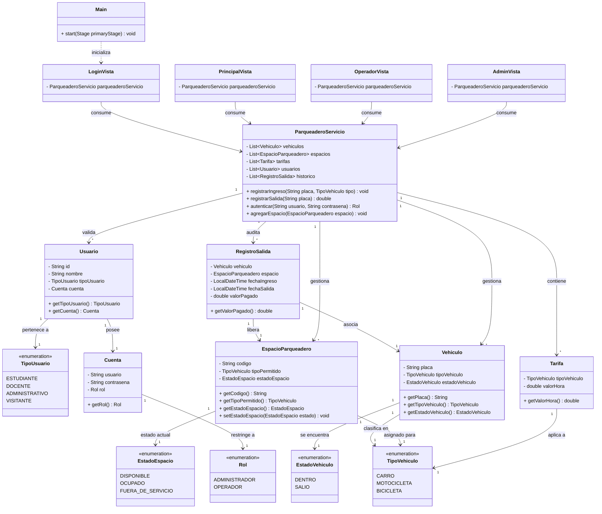

# ParkUQ — Sistema de Gestión de Parqueadero
### Universidad del Quindío
#### Proyecto desarrollado por:
* Luis Eduardo Vélez Posada
* Daniel Felipe Monsalve Montalvo
* Johan Stiven Gomez

---

## 📋 Tabla de Contenidos

1. [Análisis del Pensamiento Computacional](#1-análisis-del-pensamiento-computacional)
2. [Diagrama de Clases UML](#2-diagrama-de-clases-uml)
3. [Repositorio / Control de Versiones](#3-repositorio--control-de-versiones)
4. [Pruebas Unitarias](#4-pruebas-unitarias)
5. [Interfaz Gráfica (JavaFX)](#5-interfaz-gráfica-javafx)
6. [Excepciones](#6-excepciones)
7. [Estructura del Proyecto](#7-estructura-del-proyecto)
8. [Cómo Ejecutar](#8-cómo-ejecutar)
9. [Credenciales por Defecto](#9-credenciales-por-defecto)
10. [Espacios y Tarifas](#10-espacios-y-tarifas)

---

## 1. Análisis del Pensamiento Computacional

El desarrollo de **ParkUQ** se fundamenta en los cuatro pilares del pensamiento computacional, permitiendo abordar la problemática de la gestión de estacionamientos universitarios de manera estructurada y escalable.

### 🔷 1.1 Descomposición

El sistema global se dividió en **seis componentes independientes**, cada uno con responsabilidad única:

| Componente | Descripción |
|---|---|
| **Gestión de Autenticación y Acceso** | Control de sesiones de usuarios operativos (`ADMINISTRADOR`, `OPERADOR`) mediante validación segura y enrutamiento hacia sus interfaces JavaFX. |
| **Control de Celdas e Inventario** | Monitoreo y actualización en tiempo real de los estados de los espacios físicos (`EstadoEspacio`) segregados por tipo de vehículo. |
| **Registro de Movimientos** | Control de flujos de vehículos (ingresos activos y salidas del sistema) capturando marcas de tiempo exactas. |
| **Liquidación de Cuentas** | Algoritmo financiero que procesa cobros basados en horas de permanencia, tarifas base y políticas de subsidios institucionales. |
| **Manejo de Robustez (Excepciones)** | Aislamiento de errores del mundo real y lógica de negocio para evitar caídas imprevistas de la aplicación. |

### 🔷 1.2 Reconocimiento de Patrones

Se identificaron comportamientos y estructuras repetitivas para optimizar el código:

- **Estandarización del Estado Mediante Enums:** El uso de tipos enumerados comunes (`TipoVehiculo`, `TipoUsuario`) permite automatizar de forma homogénea las asignaciones y los cálculos lógicos en toda la capa de negocio.

- **Ciclo de Vida de Ocupación:** Todo vehículo sigue el mismo patrón transaccional:
  ```
  Validar unicidad → Asignar celda libre → Registrar ingreso
       → Calcular cobro según permanencia → Liberar celda → Archivar histórico
  ```

- **Tratamiento de Errores Unificado:** Todas las validaciones críticas comparten una arquitectura común de excepciones personalizadas heredadas de `Exception`, lo que facilita su captura y visualización homogénea en la GUI de JavaFX.

### 🔷 1.3 Abstracción

Se eliminaron los detalles irrelevantes del mundo real, conservando únicamente los atributos críticos para las reglas de negocio:

| Entidad | Datos omitidos | Datos conservados |
|---|---|---|
| **Vehículo** | Color, modelo, marca, cilindraje | `placa`, `tipoVehiculo`, `estadoVehiculo` |
| **Usuario** | Datos biográficos personales | `tipoUsuario` (para descuentos), `Cuenta` (para seguridad) |
| **Espacio de Parqueadero** | Ubicación física, señalización | `codigo`, `tipoPermitido`, disponibilidad |

### 🔷 1.4 Diseño de Algoritmos

**Algoritmo de Registro de Ingreso:**
```
1. Recibir parámetros: placa y tipoVehiculo
2. Validar que la placa no esté en un vehículo activo
   └─ Si existe → lanzar PlacaDuplicadaException
3. Filtrar espacios donde tipoPermitido == tipoVehiculo AND estadoEspacio == DISPONIBLE
   └─ Si vacío → lanzar SinEspaciosDisponiblesException
4. Seleccionar la primera celda óptima encontrada
5. Mutar estado de la celda a OCUPADO
6. Generar estampa temporal de ingreso
```

**Algoritmo de Liquidación y Salida:**
```
1. Capturar placa del vehículo saliente
2. Buscar vehículo en inventario activo
   └─ Si no existe → lanzar VehiculoNoEncontradoException
3. Calcular horas de permanencia (redondeo hacia arriba)
4. Consultar tarifa base según TipoVehiculo
5. Obtener porcentaje de descuento según TipoUsuario
6. Calcular cobro:

        Total = (Horas × Tarifa Base) × (1 − Descuento)

7. Cambiar celda a DISPONIBLE, mutar vehículo a SALIO
8. Persistir transacción en RegistroSalida
```

---

## 2. Diagrama de Clases UML

El siguiente diagrama representa la arquitectura del sistema, la separación de responsabilidades y las interacciones entre el modelo de datos, la capa de servicios y las interfaces gráficas.


---

## 3. Repositorio / Control de Versiones

> https://github.com/LuisVelez1/Proyecto-Final

---

## 4. Pruebas Unitarias

> ✅ **23 pruebas JUnit 5** — ubicadas en `src/test/java/co/uniquindio/parkuq/ParqueaderoServicioTest.java`

Para ejecutarlas:
```bash
mvn test
```

---

## 5. Interfaz Gráfica (JavaFX)

La aplicación cuenta con cuatro vistas desarrolladas en JavaFX:

| Vista | Descripción |
|---|---|
| `LoginVista` | Pantalla de autenticación de usuarios operativos |
| `PrincipalVista` | Panel principal post-login |
| `OperadorVista` | Gestión de ingresos y salidas de vehículos |
| `AdminVista` | Administración de espacios, tarifas y usuarios |

Para iniciar la aplicación:
```bash
mvn javafx:run
```

---

## 6. Excepciones

El sistema maneja errores de negocio mediante excepciones personalizadas, todas heredadas de `Exception`:

| Excepción | Cuándo se lanza |
|---|---|
| `PlacaDuplicadaException` | El vehículo ya se encuentra registrado dentro del parqueadero |
| `SinEspaciosDisponiblesException` | No hay celdas libres para el tipo de vehículo solicitado |
| `VehiculoNoEncontradoException` | La placa indicada no corresponde a ningún vehículo activo |
| `EspacioDuplicadoException` | Se intenta registrar un código de espacio ya existente |
| `UsuarioDuplicadoException` | Se intenta crear un usuario con ID ya registrado |
| `CredencialesInvalidasException` | Usuario o contraseña incorrectos al iniciar sesión |

---

## 7. Estructura del Proyecto

```
parkuq/
├── pom.xml
└── src/
    ├── main/java/co/uniquindio/parkuq/
    │   ├── Main.java                        ← Punto de entrada JavaFX
    │   ├── module-info.java
    │   ├── enums/
    │   │   ├── TipoVehiculo.java            ← CARRO, MOTOCICLETA, BICICLETA
    │   │   ├── TipoUsuario.java             ← ESTUDIANTE, DOCENTE, ADMINISTRATIVO, VISITANTE
    │   │   ├── EstadoVehiculo.java          ← DENTRO, SALIO
    │   │   ├── EstadoEspacio.java           ← DISPONIBLE, OCUPADO, FUERA_DE_SERVICIO
    │   │   └── Rol.java                     ← ADMINISTRADOR, OPERADOR
    │   ├── modelo/
    │   │   ├── Vehiculo.java
    │   │   ├── EspacioParqueadero.java
    │   │   ├── Tarifa.java
    │   │   ├── Usuario.java
    │   │   ├── Cuenta.java
    │   │   └── RegistroSalida.java
    │   ├── excepciones/
    │   │   ├── PlacaDuplicadaException.java
    │   │   ├── SinEspaciosDisponiblesException.java
    │   │   ├── VehiculoNoEncontradoException.java
    │   │   ├── EspacioDuplicadoException.java
    │   │   ├── UsuarioDuplicadoException.java
    │   │   └── CredencialesInvalidasException.java
    │   ├── servicio/
    │   │   └── ParqueaderoServicio.java     ← Toda la lógica de negocio
    │   └── vista/
    │       ├── LoginVista.java
    │       ├── PrincipalVista.java
    │       ├── OperadorVista.java
    │       └── AdminVista.java
    └── test/java/co/uniquindio/parkuq/
        └── ParqueaderoServicioTest.java     ← 23 pruebas JUnit 5
```

---

## 8. Cómo Ejecutar

### Requisitos
- Java 21 LTS
- Maven 3.8+

```bash
# Ejecutar la aplicación
mvn javafx:run

# Ejecutar pruebas
mvn test

# Compilar
mvn compile 
```

---

## 9. Credenciales por Defecto

| Usuario | Contraseña | Rol |
|---|---|---|
| `admin` | `admin123` | ADMINISTRADOR |
| `operador` | `op123` | OPERADOR |

---

## 10. Espacios y Tarifas

### Espacios predefinidos

| Código | Tipo | Cantidad |
|---|---|---|
| C-01 a C-05 | CARRO | 5 |
| M-01 a M-03 | MOTOCICLETA | 3 |
| B-01 a B-02 | BICICLETA | 2 |

### Tarifas por defecto

| Tipo | Valor / Hora |
|---|---|
| Carro | $3.000 |
| Motocicleta | $1.500 |
| Bicicleta | $500 |

### Descuentos por tipo de usuario

| Tipo Usuario | Descuento |
|---|---|
| Estudiante | 10% |
| Docente | 20% |
| Administrativo | 15% |
| Visitante | 0% |